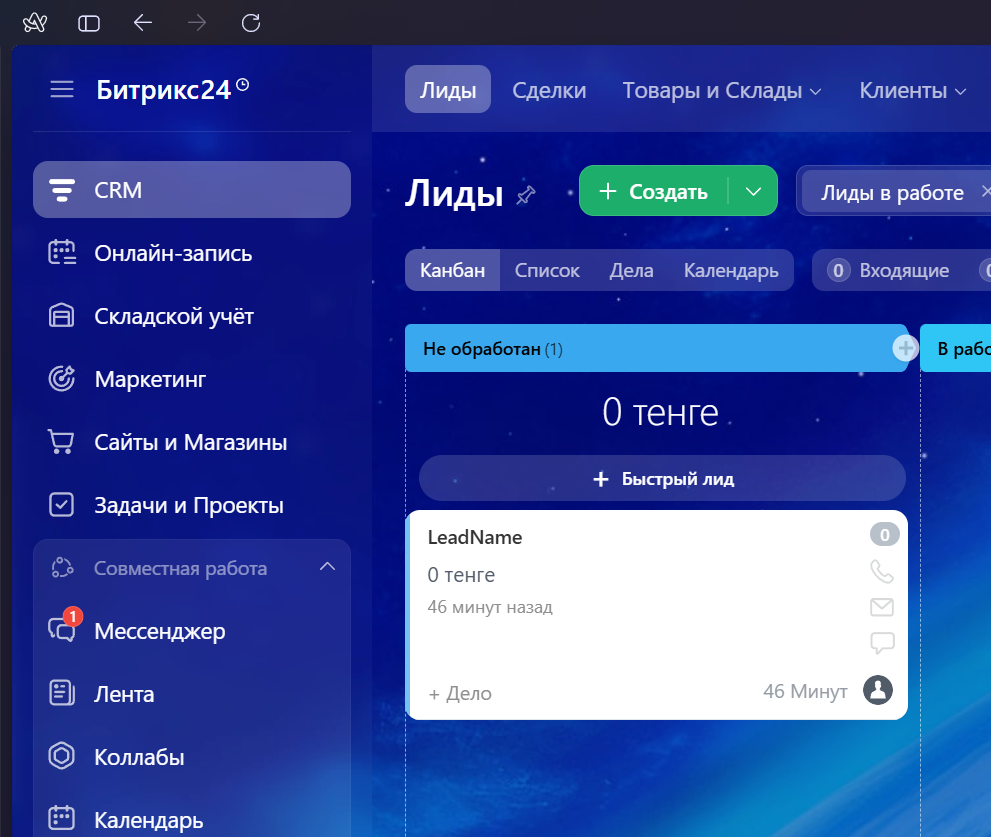
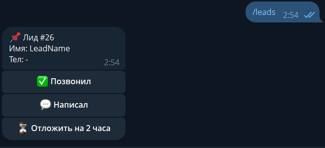
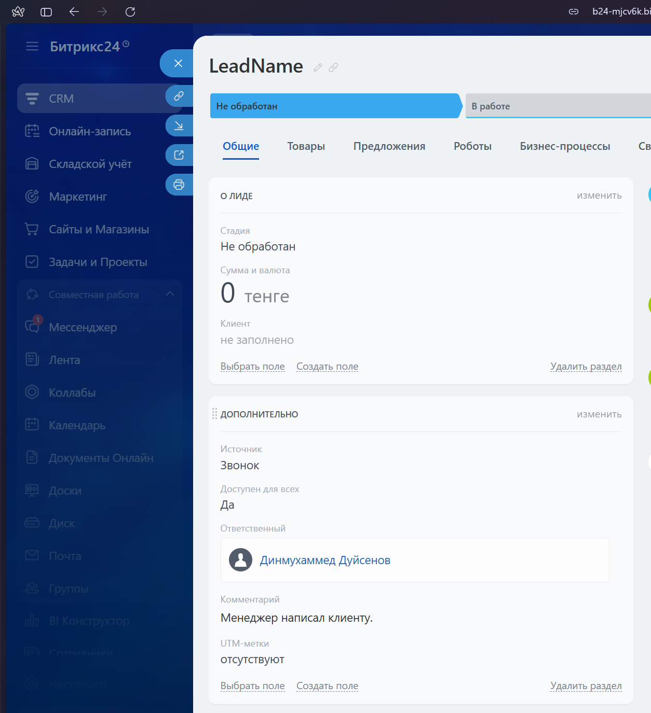
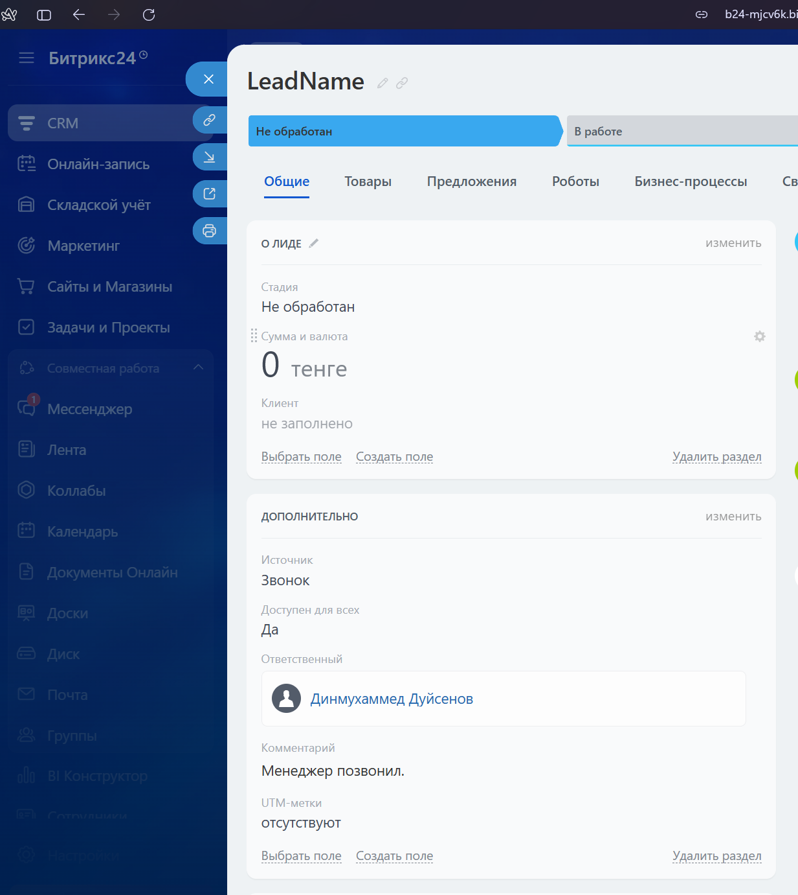
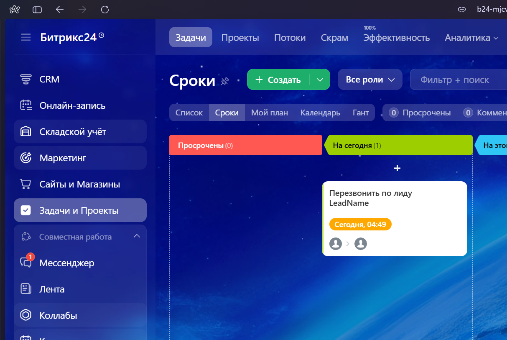

Telegram Bot for Bitrix24 Leads

Бот для Telegram, интегрированный с Bitrix24, который позволяет:
   - Получать новые лиды из Bitrix24.
   - Отслеживать лиды, созданные более 2 часов назад.
   - Создавать задачи с дедлайном и комментарием.
   - Отмечать звонки и сообщения по лидам через кнопки в Telegram.

# 🤖 AlvoTZ Bot


## 🚀 Быстрый старт

### 1. Клонирование репозитория

```bash
git clone https://github.com/dinmukhamed1729/AlvoTZ.git
cd AlvoTZ
```

### 2. Настройка переменных окружения
Оставил свои данные для вашего удобства 
Откройте файл `.env` и заполните обязательные поля:

```env
WEBHOOK=https://your-bitrix24.bitrix24.ru/rest/1/xxxxxxxxx/
BOT_TOKEN=7123456789:AAFxxxxxxxxxxxxxxxxxxxxxxxxxxxxx
```

> ⚙️ **WEBHOOK** — webhook для работы с CRM Bitrix24  
> 🤖 **BOT_TOKEN** — токен вашего Telegram-бота (@BotFather)
> **MANAGER_CHAT_ID** - чат id можно получить от телеграм бота @userinfobot да это айду нужен потому что мне было лень подгонять бд
> 
### 3. Запуск через Docker Compose

```bash
cd src
docker-compose up --build
```

Готово! Контейнеры собраны и запущены. Бот работает в фоновом режиме.

> Для работы в фоне используйте: `docker-compose up -d --build`

### 4. Использование бота

Найдите вашего бота в Telegram и отправьте команду:

```
/leads
```

**Что покажет бот:**
- Все новые лиды за последние 2 часа
- кнопки написал и позвонил а также отложить на 2 часа
- 

---
### Результаты работы 
1 список лидов



2 список лидов в боте 



3 Комментарий, что менеджер написал 



4 Комментарий, что менеджер позвонил



5 Созданная задача в списке Задачи и проекты с крайним сроком через 2 часа




